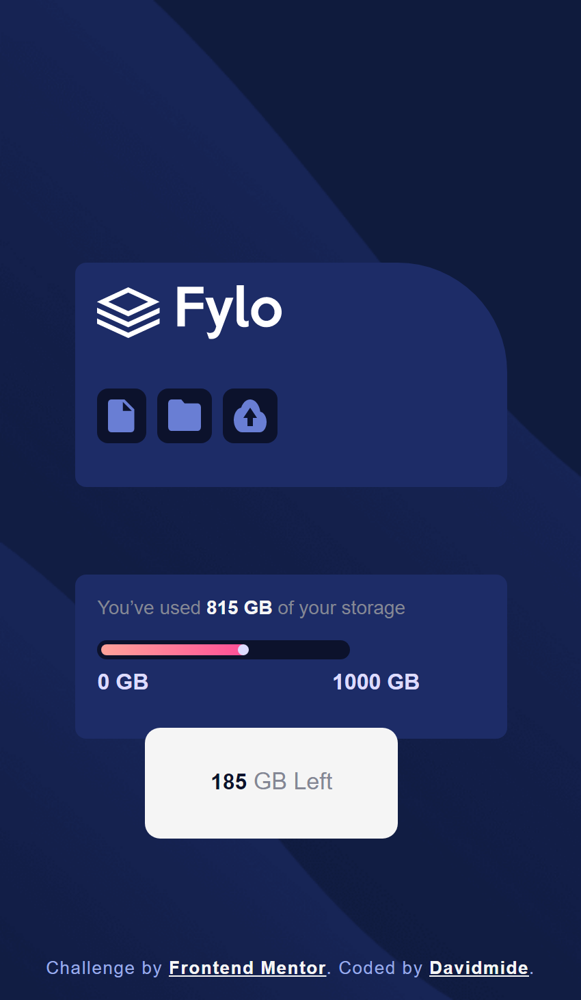

# Frontend Mentor - Fylo data storage component solution

This is a solution to the [Fylo data storage component challenge on Frontend Mentor](https://www.frontendmentor.io/challenges/fylo-data-storage-component-1dZPRbV5n). Frontend Mentor challenges help you improve your coding skills by building realistic projects. 

## Table of contents

- [Overview](#overview)
  - [The challenge](#the-challenge)
  - [Screenshot](#screenshot)
  - [Links](#links)
- [My process](#my-process)
  - [Built with](#built-with)
  - [What I learned](#what-i-learned)
  - [Continued development](#continued-development)
  - [Useful resources](#useful-resources)
- [Author](#author)
- [Acknowledgments](#acknowledgments)

## Overview
The challenge is to build a website that one can upload document, file and folder with the storage capacity remaining.

### The challenge

Users should be able to:

- View the optimal layout for the site depending on their device's screen size

### Screenshot

[ Desktop view](./images/fylo-data-storage-desktopveiw.png)S

### Links

- Solution URL: [Add solution URL here](https://github.com/Davidmide02/fylo-data-storage-component-master.git)
- Live Site URL: [Add live site URL here](https://your-live-site-url.com)

## My process
- Analysis the layout
- Setting the html layout
- Styling
- Cleaning ups

### Built with

- Semantic HTML5 markup
- CSS custom properties
- Flexbox
- CSS Grid

### What I learned

I learnt how to shape divs using css properties 

### Useful resources

- [Example resource 1](https://www.Youtube.com) 

## Author
- Frontend Mentor - [@Davidmide02](https://www.frontendmentor.io/profile/Davidmide02)
- Twitter - [@Davidmide02](https://www.twitter.com/Davidmide02)

